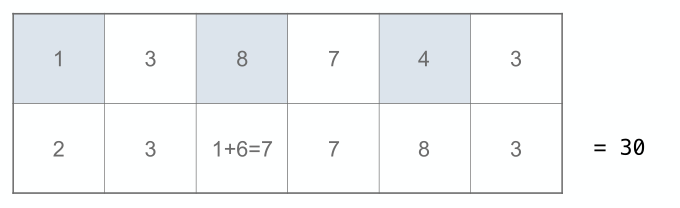

# The Luhn Algorithm

Algorithm used to verify Credit Card numbers

## Description

The Luhn algorithm or Luhn formula, also known as the "modulus 10" or "mod 10" algorithm, named after its creator, IBM scientist Hans Peter Luhn.

It is a simple checksum formula used to validate a variety of identification numbers, such as credit card numbers, IMEI numbers, etc. In addition to credit card numbers, this algorithm is also used to calculate the check digit on SIM card numbers.

The algorithm is in the public domain and is in wide use today. It is specified in ISO/IEC 7812-1. It is not intended to be a cryptographically secure hash function; it was designed to protect against accidental errors, not malicious attacks.

## Procedure

1. From the rightmost digit, which is the check digit, moving left, double the value of every second digit; if product of this doubling operation is greater than 9 (e.g., 7 \* 2 = 14), then sum the digits of the products (e.g., 10: 1 + 0 = 1, 14: 1 + 4 = 5).
2. Take the sum of all the digits.
3. The Luhn sum of a valid credit card number is a multiple of 10.

## Notes

The Luhn algorithm will detect any single-digit error, as well as almost all transpositions of adjacent digits. It will not, however, detect transposition of the two-digit sequence 09 to 90 (or vice versa). It will detect most of the possible twin errors (it will not detect 22 ↔ 55, 33 ↔ 66 or 44 ↔ 77).

Because the algorithm operates on the digits in a right-to-left manner and zero digits affect the result only if they cause shift in position, zero-padding the beginning of a string of numbers does not affect the calculation.

Therefore, systems that pad to a specific number of digits (by converting 1234 to 0001234 for instance) can perform Luhn validation before or after the padding and achieve the same result.

Source: [Wikipedia](http://en.wikipedia.org/wiki/Luhn_algorithm)
